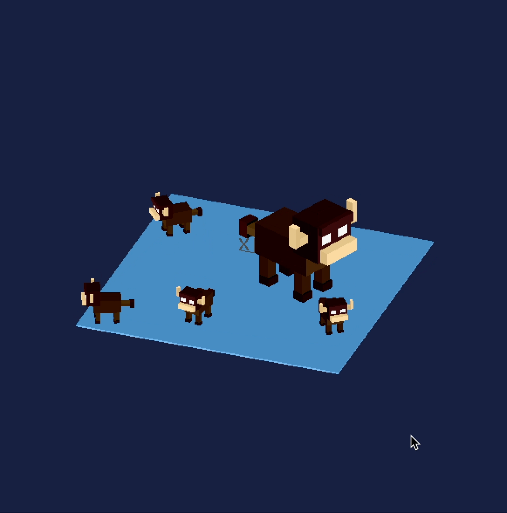

> Simon Walker  
> 9/10/2023  
> 3D Scene  

# Buff

I created my own geometry library building up from Vectors in 3-Space, to polygons,
frustums, and prisms. I added a group object and convenience functions that made
it easy to extrude, rotate, scale, and position without having to worry about
the openGL state machine.

# Time

About 3 days
- Spent about 30m making sure I properly understood depth buffering.
- 1 hour implementing my own 3d geometry library.
- 4 hours finding a bug introducing garbage values into the program
because I misunderstood $(i + 1 ~~\%~~ n)$ as $(i + 1) ~~\%~~ n$ when
it is actually $i + (1 ~~\%~~ n)$.
- Another 2ish hours on the geometry library.
- 4ish hours 3d modelling in code.

Take my estimate of the hour*age* with a grain of salt. (~3 days)

